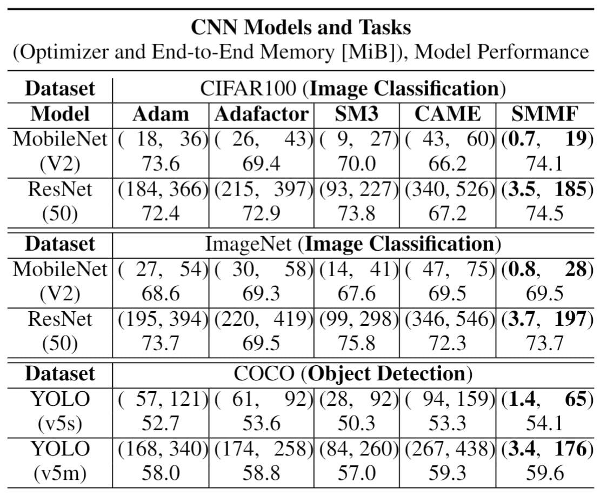

# [AAAI 2025 Submission] SMMF: Square-Matricized Momentum Factorization for Memory-Efficient Optimization

## Code implementation of [AAAI 2025 Submission] SMMF: Square-Matricized Momentum Factorization for Memory-Efficient Optimization
* Code is based on the below algorithms in the paper.
  * Brief SMMF
  * Square-Matricization
  * Decompression
  * Compression

# Introduction
This repository provides code for SMMF, which is an open-sourced official implementation of paper **_SMMF: Square-Matricized Momentum Factorization for Memory-Efficient Optimization_**. SMMF square-matricizes both first momentum and second momentum in adaptive learning-rate optimizer and factorizes them using Non-Negative Factorization (NNMF) method seperating the sign of the first momentum tensor and storing it in lower than 32-bit format (i.e., 8-bit and 1-bit).

# Example Environment
```
NVIDIA GeForce RTX 3090
Driver Version: 535.154.05
```
```
Python (venv): 3.10.0
torch:  2.0.0
torchvision:  0.16.2
numpy:  1.26.3
transformers: 4.37.0
```
# Dependencies
```
pip install -r requirements.txt
pip install -e .
```

# Train 
We provide example code of training ResNet-50 on CIFAR100 using SMMF (8-bit format sign matrix).   
To begin train, execute the below shell script.   

```
./scripts/train.sh
```
The train accuracy and evaluation accuracy of the code are about 99.99% and 75.5%.

# Memory usage of Adam vs. SMMF.
The memory consumption of Adam and SMMF (1-bit format sign matrix).
 


# Purpose of this project
This is the implementation of SMMF, with detailed hyperparameter settings.

The recommended range of decay-rate is from -0.5 to -0.8. Throughout experiments, we recommend to use -0.5 for CNN based models for stable learning and -0.8 for Transformer based models for better performance.

# How to install only SMMF
You can only install SMMF using pip
```
pip install -e .
```

## How to import and use SMMF.
```python
from smmf import SMMF
optimizer = SMMF(
  model.parameters(),
  lr=1e-3,
  beta=0.9,
  eps=1e-8,
  weight_decay=0.0005,
  decay_rate=-0.8,
  growth_rate=0.999,
  vector_reshape=True
)
```
